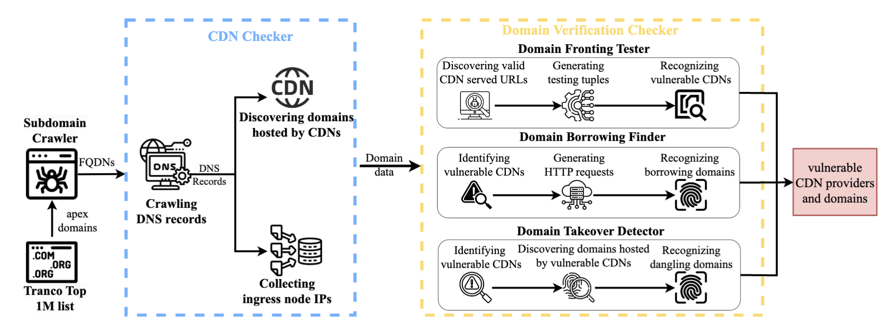

# DVAHunter

*DVAHunter* is a novel system that can automatically and periodically monitors DVA vulnerability at an Internet scale. Unlike previous tools focused on individual vulnerabilities, DVAHunter performs a comprehensive analysis of CDN domain verification and systematically measures vulnerabilities on a large scale.

<p align="center">
<kbd>

</kbd>
<br>The Architecture of DVAHunter.
</p>

## Full Code: Coming Soon!
We will release our full code in the near future.

## This is a demo Code
This is a demo code, using only a few domains as a test.

## Installation

- Download this tool
```
git clone https://github.com/LinZiyuu/DVAHunter
```

- Install dependencies
```
pip3 install -r requirements.txt
```

> *Python version: Python 3.6*

##  How to Use DAHunter to detect target domain

### 1. Subdomain Crawler
#### 1.1 Enmuate the FQDNs of target SLDs.
To run the Subdomain crawler, execute the following command in your terminal:
```
go run cmd/subdomain-crawler/main.go -i test_sld.txt -o test-subdomain
```
### 2. CDN Checker
#### 2.1 Collect the DNS records of FQDNs
To run the DAHunter, execute the following command in your terminal:
```
python3 src/dns_component/main.py -i "data/test-subdomain" -o "data/test-dns_record" -n 4 -d "8.8.8.8"
```
#### 2.2 Discover the Domains hosted by a CDN and 2.3 Collect Ingress node IPs
```
python3 src/cdn_checker/data_processer.py -df "data/test-dns_record" -cdf "data/test-cdn_dns_record" -cif "data/test-cdn_ingress_ip" -chdf "data/test-cdn_hosted_FQDN"
```

### 3. Domain Abusing Tester
#### 3.1 Domain Fronting Tester
```
python3 src/domain_fronting_component/src/main.py -cdn "Alibaba Cloud" -dns "data/test-dns_record" -cdn_dns "data/test-cdn_dns_record" -fqdn "data/test-cdn_hosted_FQDN" -target_domain_url "data/test-target_domain_urls" -tuple "data/test-tuple" -abuse_tuple "data/test-abuse_tuple"
```
#### 3.2 Domain Borrwoing Finder
```
python3 src/domain_borrowing_component/src/main.py -subdomain 'data/test-subdomain' -fqdn 'data/test-all_FQDN/test-subdomain.txt' -host 'data/test-all_FQDN/Cachefly.json' -cdn 'Cachefly' -cdn_ip 'data/test-cdn_ingress_ip' -g_cdn_ip 'data/test-cdn_ingress_ip_gourped_by_city' -db 'data/test-Domain_Borrowed'
```
#### 3.3 Domain Takeover Detector
```
python3 src/domain_takeover_component/subdomain_takeover.py -f 'data/test-cdn_dns_record' -o 'vulnerable_domains.json'
```


## License

DVAHunter is a free software and licensed under the [MIT license](/LICENSE).
